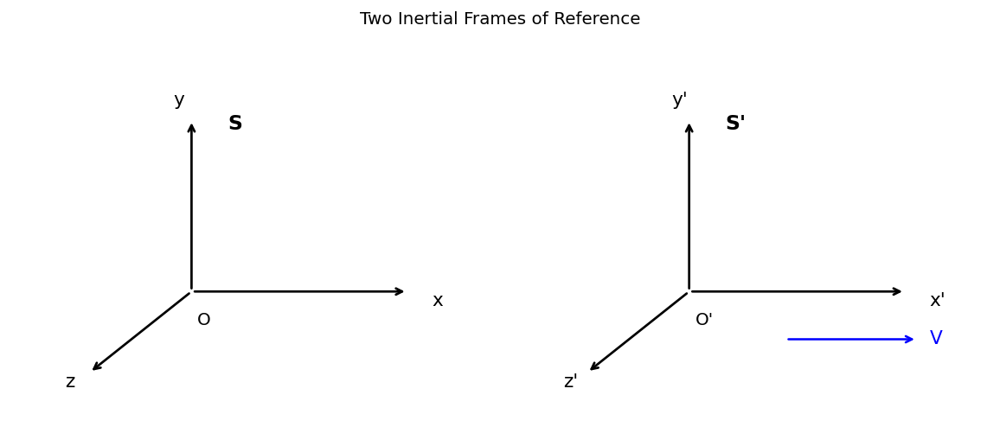
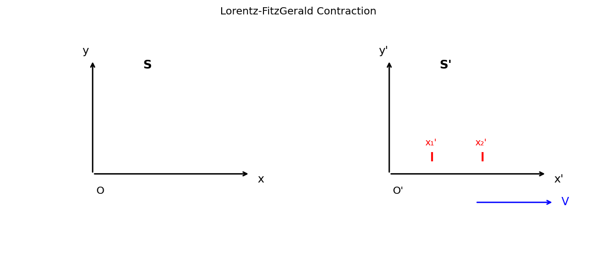
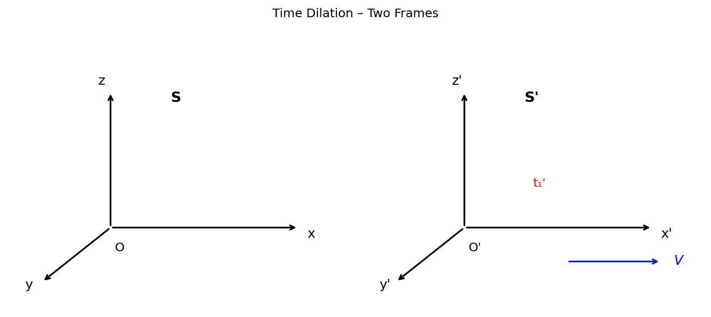
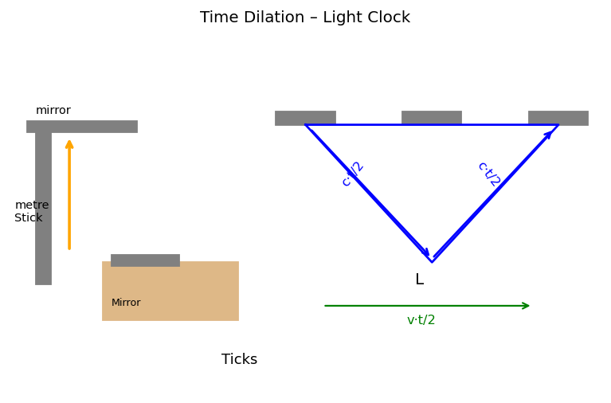
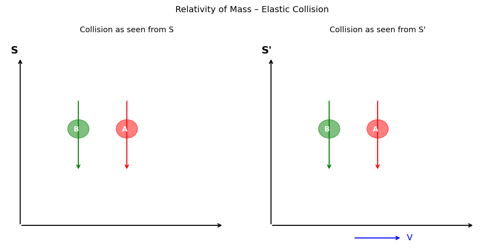
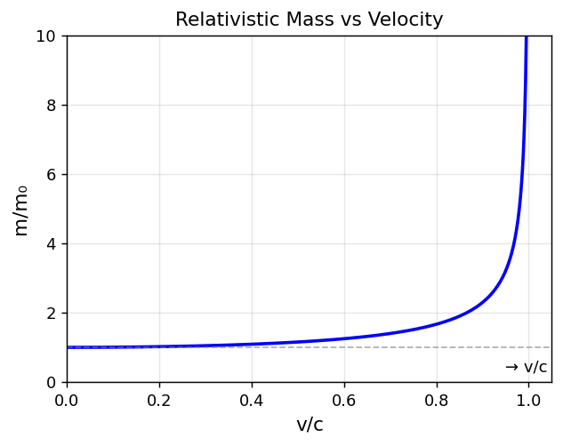
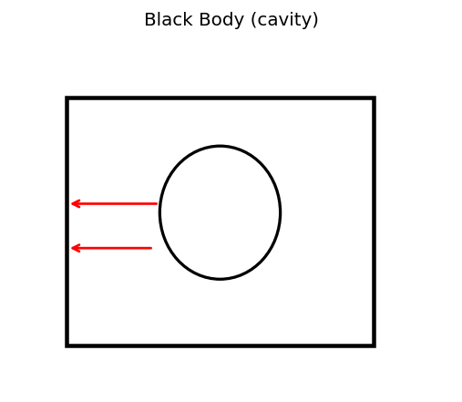

# Modern Physics
> This Note is open source,edit/extend it on: https://github.com/withlimon/Modern-Physics-Note

---

**08-01-2026 — Lecture-1**

---

$\underline{CT\text{-}1}$

>>>After 6 lecture

$\underline{CT\text{-}2}$

>>>After 13 lecture

---

## Postulates of Special Theory of Relativity

 1. The laws of physics are the same in all inertial frames of reference. 
 2. Speed of light in a vacuum is constant in all inertial frame of reference.
---

## Frame of References:

1. Absolute frame of reference [No existance of it in real life!]
2. Innertial frame of reference [One frame has constant velocity w.r.t. others]
3. Specific frame of reference [Accelerated + Others]

---

**⊞ All motions are relative**

---

## ① The Galilean Transformation:

\# Two frames are constant velocity with respect to each other.

$$S: \ x, y, z, t$$
$$S': \ x', y', z', t$$

$$\boxed{x' = x - vt} \quad \longrightarrow (i)$$

$$y' = y \quad \longrightarrow (ii)$$

$$z' = z \quad \longrightarrow (iii)$$

$$t' = t \quad \longrightarrow (iv)$$

$$\boxed{V_{x}' = \frac{dx'}{dt'} = V_x - V} \quad \longrightarrow (5)$$

$$V_{y}' = \frac{dy'}{dt'} = V_y \quad \longrightarrow (6)$$

$$V_{z}' = \frac{dz'}{dt'} = V_z \quad \longrightarrow (7)$$

---

**22-01-2026 — Lecture-2**

---

## The Lorentz Transformation:

$$S: x, y, z, t$$
$$S': x', y', z', t'$$

$$x' = K(x - vt) \quad \text{------} (1) \qquad K \text{ is not a function of } x \text{ or } t.$$

$$y' = y \quad \text{---} (3)$$

$$z' = z \quad \text{---} (4)$$

$$x = K(x' + vt') \quad \text{------} (2)$$

Putting $x'$ value,

$$x = K^2(x - vt) + Kvt'$$

$$\boxed{t' = Kt + \left(\frac{1-K^2}{Kv}\right)x} \quad \longrightarrow (5)$$

at,  $t = t'$

$$x = ct \quad \text{---} (6)$$

$$x' = ct' \quad \text{---} (7)$$

From eqn ⑤, ⑦ & ①

$$x' = K(x - vt) = cKt + \left(\frac{1-K^2}{Kv}\right)cx \quad \left[x' = ct'\right]$$

$$x = \frac{cKt + vKt}{K - \left(\frac{1-K^2}{Kv}\right)c}$$

$$x = ct\left[\frac{1 + \frac{v}{c}}{1 - \left(\frac{1}{K^2}-1\right)\frac{c}{v}}\right] \quad \text{----} (8) \quad [x = ct]$$

Comparing with eqn 6,

eqn(6) & (8) eqns comparing,

$$\text{So} \left[\frac{1 + \frac{v}{c}}{1 - \left(\frac{1}{K^2}-1\right)\frac{c}{v}}\right] = 1$$

$$\boxed{K = \frac{1}{\sqrt{1 - \dfrac{v^2}{c^2}}}} \quad \text{---} (9)$$

Putting $K$ value eqn $1,$

$$x' = \frac{x - vt}{\sqrt{1 - \dfrac{v^2}{c^2}}} \qquad y' = y \qquad z' = z$$

$$t' = \frac{t - \dfrac{vx}{c^2}}{\sqrt{1 - \dfrac{v^2}{c^2}}}$$

---

## Inverse Lorentz Transformation:

$$x = \frac{x' + vt'}{\sqrt{1 - \dfrac{v^2}{c^2}}} \qquad y = y' \qquad z = z'$$

$$t = \frac{t' + \dfrac{vx}{c^2}}{\sqrt{1 - \dfrac{v^2}{c^2}}}$$

### ⊞ Conclusion:

$$\boxed{x' = \frac{x - vt}{\sqrt{1 - \dfrac{v^2}{c^2}}}} \qquad \boxed{x = \frac{x' + vt'}{\sqrt{1 - \dfrac{v^2}{c^2}}}}$$

$$\boxed{t' = \frac{t - \dfrac{vx}{c^2}}{\sqrt{1 - \dfrac{v^2}{c^2}}}} \qquad \boxed{t = \frac{t' + \dfrac{vx}{c^2}}{\sqrt{1 - \dfrac{v^2}{c^2}}}}$$

---

**29-01-2026 — Lecture-03**

---

## The Lorentz-FitzGerald Contraction:

**Length**

$$L_o = x_2' - x_1' \quad \text{----} (1)$$

$$x_1' = \frac{x_1 - Vt}{\sqrt{1 - \dfrac{v^2}{c^2}}} \quad \text{----} (2)$$

$$x_2' = \frac{x_2 - Vt}{\sqrt{1 - \dfrac{v^2}{c^2}}} \quad \text{----} (3)$$

$$L_o = x_2' - x_1' = \frac{x_1 - x_2}{\sqrt{1 - \dfrac{v^2}{c^2}}} = \frac{L}{\sqrt{1 - \dfrac{v^2}{c^2}}} \qquad \left[L = x_2 - x_1\right], \quad \left[L_o = x_2' - x_1'\right]$$

$$\boxed{L = L_o\sqrt{1 - \frac{v^2}{c^2}}} \quad \text{---} (4)$$

L is contracted in motion; There is no effect of sign of velocity.

---

## Time Dilation:

$$t_1 = \frac{t_1' + \dfrac{Vx'}{c^2}}{\sqrt{1 - \dfrac{v^2}{c^2}}} \quad \text{---} (I)$$

$$t_o = t_2' - t_1' \quad \text{---} (II)$$

$$t_2 = \frac{t_2' + \dfrac{Vx'}{c^2}}{\sqrt{1 - \dfrac{v^2}{c^2}}} \quad \text{---} (III)$$

$$t_o = t_2 - t_1$$

$$= \frac{t_2' - t_1'}{\sqrt{1 - \dfrac{v^2}{c^2}}} \quad (p)$$

$$\boxed{t = \frac{t_o}{\sqrt{1 - \dfrac{v^2}{c^2}}}} \quad \text{----} (IV)$$

---

*(Light clock diagram with metre stick, mirrors and moving triangle)*

$$t_o = \frac{2L}{c}$$

$$= \frac{2\,\text{m}}{3 \times 10^{8}\,\text{ms}^{-1}} = 0.67 \times 10^{-8} \text{ sec}$$

$$\approx 1.5 \times 10^{8} \text{ ticks/sec}$$

$$\left(c \times \frac{t}{2}\right)^2 = \cancel{B}L^2 + \left(v \cdot \frac{t}{2}\right)^2$$

$$\frac{t^2}{4}(c^2 - v^2) = L^2$$

$$t^2 = \frac{4L^2}{c^2 - v^2} = \frac{(2L/c)^2}{1 - \dfrac{v^2}{c^2}}$$

$$\boxed{t = \frac{2L/c}{\sqrt{1 - \dfrac{v^2}{c^2}}} = \frac{t_o}{\sqrt{1 - \dfrac{v^2}{c^2}}}} \quad \text{---} (3) \qquad \left[t_o = \frac{2L}{c}\right]$$

---

**05-02-2026 — Lecture-04**

---

## Meson Decay

$$2 \times 10^{-6} \text{ s}$$

$$2.994 \times 10^{8} \text{ m/s}$$

$$d = Vt_o = 2.994 \times 10^{8} \text{ m/s} \times 2 \times 10^{-6} \text{ s}$$

$$= 600 \text{ m}$$

$$\frac{d}{d_o} = \sqrt{1 - \frac{v^2}{c^2}}$$

$$d_o = \frac{d}{\sqrt{1 - \dfrac{v^2}{c^2}}} = \frac{600}{\sqrt{1 - \left(\dfrac{0.9985c}{c}\right)^2}} = 9500 \text{ m}$$

$$t = \frac{t_o}{\sqrt{1 - \dfrac{v^2}{c^2}}} = \frac{2 \times 10^{-6} \text{ s}}{\sqrt{1 - \left(\dfrac{0.998c}{c}\right)^2}} = 3.17 \times 10^{-6} \text{ sec}$$

$$d_o = Vt = 2.994 \times 10^{8} \text{ m/s} \times 3.17 \times 10^{-6} \text{ s}$$

$$= 9500 \text{ m}$$

---

## Simultaneity:

$$t_1' = \frac{t_o - \dfrac{Vx_1}{c^2}}{\sqrt{1 - \dfrac{v^2}{c^2}}} \quad \longrightarrow \textcircled{1}$$

$$t_2' = \frac{t_o - \dfrac{Vx_2}{c^2}}{\sqrt{1 - \dfrac{v^2}{c^2}}} \quad \longrightarrow \textcircled{II}$$

$$t_2' - t_1' = \frac{(x_1 - x_2)\dfrac{V}{c^2}}{\sqrt{1 - \dfrac{v^2}{c^2}}}$$

⊞

$$x_1^2 + y_1^2 \qquad x_1'^{\,2} + y_1'^{\,2}$$

$$x_1^2 + y_1^2 = x_1'^{\,2} + y_1'^{\,2}$$

$$i = \sqrt{-1}$$

$$ict$$

$$x^2 + y^2 + z^2 - (ct)^2$$

$$= x_1'^{\,2} + y_1'^{\,2} + z_1'^{\,2} - (ct')^2$$

---

## Velocity Addition

$$V_x = \frac{dx}{dt} \quad \longrightarrow \textcircled{1} \qquad V_x' = \frac{dx'}{dt'} \quad \longrightarrow \textcircled{4}$$

$$V_y = \frac{dy}{dt} \quad \longrightarrow \textcircled{2} \qquad V_y' = \frac{dy'}{dt'} \quad \longrightarrow \textcircled{5}$$

$$V_z = \frac{dz}{dt} \quad \longrightarrow \textcircled{3} \qquad V_z' = \frac{dz'}{dt'} \quad \longrightarrow \textcircled{6}$$

$$dx' = \frac{dx - vdt}{\sqrt{1 - \dfrac{v^2}{c^2}}} \quad \longrightarrow \textcircled{7} \quad [\text{লরেন্জ}]$$

$$dy' = dy \quad \longrightarrow \textcircled{8}$$

$$dz' = dz \quad \longrightarrow \textcircled{9}$$

$$dt' = \frac{dt - \dfrac{v}{c^2}\,dx}{\sqrt{1 - \dfrac{v^2}{c^2}}} \quad \longrightarrow \textcircled{10}$$

eqn ④ & ⑦

$$V_x' = \frac{dx'}{dt'} = \frac{\dfrac{dx}{dt} - v\dfrac{dt}{dt}}{\dfrac{dt}{dt} - \dfrac{v}{c^2}\dfrac{dx}{dt}} = \frac{V_x - V}{1 - \dfrac{VV_x}{c^2}} \quad \longrightarrow \textcircled{11}$$

$$\therefore \quad \boxed{V_x' = \frac{V_x - V}{1 - \dfrac{VV_x}{c^2}}}$$

---

Similarly,

$$V_y' = \frac{V_y\sqrt{1 - \dfrac{v^2}{c^2}}}{1 - \dfrac{VV_x}{c^2}} \quad \longrightarrow \textcircled{12}$$

$$V_z' = \frac{V_z\sqrt{1 - \dfrac{v^2}{c^2}}}{1 - \dfrac{V_x V}{c^2}} \quad \longrightarrow \textcircled{13}$$

$$V_x = \frac{V_x' + V}{1 + \dfrac{V}{c^2}V_x'} \quad \longrightarrow \textcircled{14}$$

$$V_y = \frac{V_y'\sqrt{1 - \dfrac{v^2}{c^2}}}{1 + \dfrac{V_x'V}{c^2}} \quad \longrightarrow \textcircled{15}$$

$$V_z = \frac{V_z'\sqrt{1 - \dfrac{v^2}{c^2}}}{1 + \dfrac{V_x'V}{c^2}} \quad \longrightarrow \textcircled{16}$$

when,

$V_x = V$ from equation ⑭ &
Putting $V_x' = c,$

$$V_x = \frac{c + V}{1 + \dfrac{V}{c}} = \frac{V + c}{\dfrac{V + c}{c}} = c \qquad \boxed{V_x = c} \quad \text{Proved}$$

$$\boxed{\text{So, if } V_x' = c \text{ then } V_x = c} \rightarrow c \text{ is always constant}$$

---

**10/02/2026 — Lecture-5**

---

## ① The Relativity of Mass

Fig 1: &emsp;&emsp;&emsp;&emsp;&emsp;&emsp;&emsp;&emsp;&emsp;&emsp;&emsp;&emsp;&emsp; Fig 2:

Collision as seen from S &emsp;&emsp;&emsp;&emsp; collision as seen from S'

⊞ Elastic collision → No energy loss (assumption)

---

③ Fig 1 এ A এবং Fig 2 এ B লোজ একইদিকে উঠবে নামবে।

from S,

$$T_o = \frac{Y}{V_A} \quad \text{------} (I) \qquad [\text{where, } Y = \text{distance}]$$

for S', &emsp; $[V_A \text{ or } V_B' \ll\!\ll V]$

$$T_o = \frac{Y}{V_{B'}} \quad \text{----} (II)$$

$$M_A V_A = M_B V_B \quad \text{----} (III) \quad [\text{from frame S}]$$

$$V_B = \frac{Y}{T} \quad \text{----} (IV)$$

$$V_B = \frac{V}{\dfrac{T_o}{\sqrt{1 - \dfrac{v^2}{c^2}}}} \qquad \left[T = \frac{T_o}{\sqrt{1 - \dfrac{v^2}{c^2}}}\right]$$

$$V_B = \frac{V\sqrt{1 - \dfrac{v^2}{c^2}}}{T_o} \quad \text{----} (V)$$

from eqn (III):

$$M_A V_A = M_B V_B$$

$$M_A\frac{Y}{T_o} = M_B\frac{Y\left(\sqrt{1 - \dfrac{v^2}{c^2}}\right)}{T_o}$$

$$\boxed{M_A = M_B\sqrt{1 - \frac{v^2}{c^2}}} \quad \text{-----} (VI)$$

---

$$y = \tfrac{1}{2}Y \qquad y' = \tfrac{1}{2}Y$$

⊞ $M_A = m_o$

$M_B = m$

From eqn (vi):

$$m = \frac{m_o}{\sqrt{1 - \dfrac{v^2}{c^2}}}$$

$$p = mv = \frac{m_o v}{\sqrt{1 - \dfrac{v^2}{c^2}}}$$

$$F = \frac{dp}{dt} = \frac{d(mv)}{dt} = m\frac{dv}{dt} + v\frac{dm}{dt}$$

---

**26-02-26 — Lecture-6**

---

## Mass and Energy

$$K.E = \int_0^S F\,ds$$

$$= \int_0^S \frac{d}{dt}(mv)\,ds$$

$$= \int_0^v v\,d(mv)$$

$$= \int_0^v v\,d\!\left(\frac{m_o v}{\sqrt{1 - \dfrac{v^2}{c^2}}}\right)$$

$$= \frac{m_o v^2}{\sqrt{1 - \dfrac{v^2}{c^2}}} - m_o\int_0^v \frac{v\,dv}{\sqrt{1 - \dfrac{v^2}{c^2}}} \qquad \left[\int u\,dy = xy - \int y\,dx\right]$$

$$= \frac{m_o v^2}{\sqrt{1 - \dfrac{v^2}{c^2}}} + \left[m_o c^2\sqrt{1 - \frac{v^2}{c^2}}\right]_0^v$$

$$= \frac{m_o c^2}{\sqrt{1 - \dfrac{v^2}{c^2}}} - m_o c^2$$

$$\boxed{T = mc^2 - m_o c^2} \quad \longrightarrow \textcircled{10}$$

$$= (m - m_o)\,c^2$$

---

$$\boxed{mc^2 = m_o c^2 + T}$$

$$\hookrightarrow T = \text{kinetic Energy}$$

When,

$T = 0$

$$mc^2 = m_o c^2$$

$\hookrightarrow$ This is rest energy even when the particle are not in motion.

$$T = mc^2 - m_o c^2$$

$$= \frac{m_o c^2}{\sqrt{1 - \dfrac{v^2}{c^2}}} - m_o c^2$$

$$= m_o c^2\!\left(1 + \tfrac{1}{2}\frac{v^2}{c^2} + \cdots\right) - m_o c^2$$

$$= m_o c^2 + \left(\tfrac{1}{2}mv^2\right) - m_o c^2$$

$$\approx \tfrac{1}{2}\,mv^2$$

$$\boxed{T = \tfrac{1}{2}\,mv^2} \quad \rightarrow \text{when } v \ll\!\ll c$$

---

## Massless particle

**Total Energy**

$$E = \frac{m_o c^2}{\sqrt{1 - \dfrac{v^2}{c^2}}} \quad \longrightarrow \textcircled{1} \qquad E^2 = \frac{m_o^2 c^4}{1 - \dfrac{v^2}{c^2}}$$

**Relative momentum**

$$p^2 = \frac{m_o^2 v^2}{1 - \dfrac{v^2}{c^2}} \quad \longrightarrow \textcircled{2}$$

$$p^2 c^2 = \frac{m_o^2 c^4 - m_o^2 v^2 c^2}{1 - \dfrac{v^2}{c^2}}$$

$$= \frac{m_o^2 c^4(c^2 - v^2)}{c^2 - v^2}$$

$$= m_o^2 c^4$$

$$E^2 = m_o^2 c^4 + p^2 c^2$$

$$\boxed{E = \sqrt{m_o^2 c^4 + p^2 c^2}} \quad \longrightarrow \textcircled{5}$$

---

if $m_0 = 0$

$$\boxed{E = pc} \rightarrow \text{Rest mass zero হলে Particle exist করতে পারে না বরং Energy থাকতে পারে যদি velocity c হয়।}$$

⊞ CT-1 এর পর্যন্ত Syllabus
&emsp;&emsp; 2টির পর প্রথম Thursday

---

## Black Body Radiation

If a body absorbs all radiation and emits the radiation then the Body is called Black Body. and the radiation is called Black body radiation.
